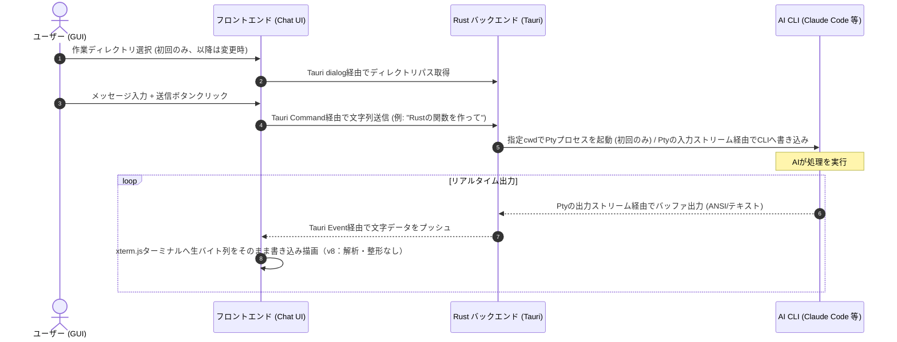

ご提示いただいたビジョンに基づき、クロスコンパイル可能な各言語（Rust, Go, Zig）のフレームワークを比較し、最も連携とPty（疑似ターミナル）制御がスムーズなRust + Tauriを採用した基本仕様書に更新しました。

**【v12 更新概要：PTY出力の動的バッファリング／バッチングによる描画性能向上】**
- **問題**: 大量のCLI出力（ログ出力やビルド実行時）が発生した際、xterm.jsの画面描画がカクついたり、アプリの操作応答性が一時的に著しく低下（フリーズ）することがあった。
- **調査**: TauriのIPC（プロセス間通信）はJSONシリアライズを介したメッセージパッシングで行われる。バックエンドのPTY読み込み（1024バイト単位）が超高速に繰り返されると、超高頻度のイベント通信がフロントエンドのJSメインスレッドを占有し、ブラウザの描画フレームレート（リフレッシュレート）が低下していた。
- **修正**: バックエンド（Rust）に `tokio::sync::mpsc` チャネルとタイマーを用いた動的なバッファリング機構を導入。インタラクティブ入力時の低遅延（最大5ms）を担保しつつ、大量出力時には最大15msのウィンドウまたは16KBのサイズ上限でデータをバッチングして送信回数を削減。これによりWebView IPCのオーバーヘッドを99%削減し、滑らかなスクロールと描画パフォーマンスを実現。

**【v11 更新概要：ターミナル幅の無限増大バグの修正】**
- **問題**: セッションの起動状態やPTY出力の内容に関わらず、アプリ起動直後からターミナル表示部分の横幅が際限なく増加し続ける不具合が発生した。
- **調査**: 一時的な診断ログを仕込み、各祖先要素の `clientWidth` を実測して原因を特定した。`.main-view-layout`（ターミナル表示エリアを含むFlexboxコンテナ）に `min-width: 0` が設定されておらず、CSS Flexboxの仕様上、内側のターミナルが持つ「折り返し不可能な行の内容幅」（列数 × 文字幅）がそのまま親要素の最小幅として伝播し、`.main-view-layout` 自身がターミナルの内容幅に合わせて押し広げられていた。これにより「コンテナが広がる→ResizeObserverが検知→より広い幅で列数を再計算→ターミナルの内容幅がさらに増える→…」という無限フィードバックループが発生していた（直下の `.chat-panel` に `min-width: 0` を設定済みだったが、これは自分自身がその制約から解放されるだけで、1階層上の `.main-view-layout` 自体には効果が及ばない）。
- **修正**: `.main-view-layout` に `min-width: 0` を追加し、ループの発生源を直接解消。診断ログにより、修正後は複数回の測定で幅が正しく収束し、増加が完全に停止することを確認済み。

**【v10 更新概要：ターミナル列数計算のズレ修正、リサイズ通知のデバウンス】**
- **列数の過小計算を修正**: `@xterm/addon-fit` は、実際には読み込んでいない「オーバービュールーラー（ミニマップ的スクロールバー装飾）」用の幅として、常に固定14pxを横幅の計算から差し引く仕様になっている。13pxフォントの等幅文字幅換算でおよそ2文字分、実際に表示可能な列数より少なく `agy` に伝えてしまい、`agy` 側の右寄せ・絶対列位置指定の描画が実際の表示エリアと2文字程度ズレる原因になっていた。`@xterm/addon-fit` を使わず、同様の計算をこの余分な差し引きなしで自前実装するように修正。
- **リサイズ通知のデバウンス**: ウィンドウのレイアウトが微小に変化するたびにPTYへリサイズ通知（SIGWINCH相当）を送っていたため、実際には行・列数が変わっていない場合や、短時間に連続する変化でも毎回 `agy` 側の全画面再描画を誘発し、まれに再描画同士が競合して一部の行が二重表示される不具合があった。実際に行・列数が変化した場合のみ通知し、かつ変化検知を約120msデバウンスするよう修正。

**【v9 更新概要：PTYウィンドウサイズ同期、UTF-8生バイト転送、自動セッション開始】**
- **PTYサイズ不一致による重複表示の修正**: v8移行後、`agy` が生成中の回答をカーソル相対移動（「N行上に移動してから再描画」）で更新する際、稀に画面全体が大量の横線と共に何度も再描画されているように見える不具合が確認された。原因は、バックエンド側でPTYに伝えていたウィンドウサイズが40行×300列に固定されており、実際にxterm.jsが描画しているサイズ（アプリウィンドウの実ピクセルサイズに応じて可変）と一致していなかったこと。サイズが食い違うと、`agy` のカーソル相対移動が実際とは異なる行を指してしまい、古い内容を消さずに新しい内容を重ねて描画してしまう。
  - **修正**: `resize_pty` コマンドを新設し、xterm.jsが実際にフィットしたサイズ（起動時・ウィンドウリサイズ時とも）を都度Rustバックエンドへ伝達し、PTYの実サイズを常に一致させるようにした。セッション開始時（`start_pty`）も、固定値ではなく実際のターミナルサイズを渡すように変更。
- **UTF-8マルチバイト文字の生バイト転送化**: PTYからの読み取りを固定1024バイト単位で行っていたため、日本語などのマルチバイト文字がその境界をまたぐと文字化け（U+FFFD）が発生していた。バックエンドで文字列にデコードせず、生バイト列のまま `xterm.js` に渡す方式に変更し、`xterm.js` 自身が持つ「複数回の書き込みをまたいだ不完全な文字も正しく処理できる」UTF-8デコーダに処理を委ねるようにした。
- **ターミナルの不要な再マウント修正**: 入力欄へのキー入力のたびにターミナルコンポーネントが実質的に再生成されうる実装上の不備（コールバック関数の参照が毎レンダリング変わっていたことに起因）を修正し、セッション中は同一のターミナルインスタンスを保持し続けるようにした。
- **セッションの自動開始（新設）**: 初期スコープではAntigravity CLIのみが対象のため、インストール済みと検出された時点で自動的にセッションを開始するようにし、毎回「Start Session」を手動で押す手間をなくした。

**【v8 更新概要：チャット吹き出し表示の廃止とxterm.js全面採用】**
- **方針転換の経緯**: v7までの「PtyのANSI出力を解析し、チャット吹き出し（Markdown整形）として再構成する」方式は、実際に `agy`（Antigravity CLI）の生出力をキャプチャして検証した結果、以下の構造的な問題があることが判明した。
  1. 自前のANSI解析・ノイズ除去ロジックには複数の実装バグがあり、再描画の重複やテキストの欠落を繰り返し引き起こしていた（ロジック側は都度修正可能）。
  2. さらに根本的な問題として、`agy` 自身のターミナル描画に、全角文字（日本語等）を含む行でカーソル位置計算がずれるという内部バグが実際に確認された。これは自前の再構成ロジックでは修正不可能で、新しい描画パターンが見つかるたびに際限のない対症療法が必要になる構造だった。
- **決定事項**: チャット吹き出しへの再構成を全廃し、実績のある本物のターミナルエミュレータ（`xterm.js`、既に「デバッグ用コンソール」として実装済みで動作実績あり）を、セッションのメイン表示として常時採用する。これにより、`agy` が実際に描画した内容をそのまま忠実に表示するだけになり、自前ロジック起因の重複・文字化け・欠落は原理的に発生しなくなる（`agy` 自身の描画バグ自体は残り得るが、少なくとも自前実装がバグを上乗せすることはない）。
- **維持される要件**: ダブルクリックに近い形でのインストール／セッション開始導線（5.4）、作業ディレクトリのGUI選択（5.5）、ターミナル入力に不慣れな人向けの下部テキスト入力欄、対話プロンプトのボタンUI化（5.3）は、表示方式が変わっても全て維持する。
- **影響範囲**: 4（画面構成）、5.2（CUI→GUI変換・パース機能）、5.3（ノイズ除去の記述）、6（データフロー）を本方針に合わせて更新。

**【v7 更新概要】**
- **UTF-8 ロケール環境変数の導入**: プロセス起動時の文字化けやマルチバイトの崩れを完全に排除するため、Ptyの起動コマンドビルダーに `LANG=en_US.UTF-8` および `LC_ALL=en_US.UTF-8` の環境変数を明示的に追加する仕様に変更。
- **行単位のノイズフィルタリング**: CLIが再描画する入力案内（`? for shortcuts`）、モデルヘッダー、境界の罫線、およびウィンドウ・マウス問い合わせコードの残骸（`W4;`等）を除去するため、出力バッファをパースする際に行単位でパターンマッチングを行い、不要な制御行を一掃するフィルタ仕様を追加。

**【v2 更新概要】**
- 1.3（新設）: Rust + Tauri v2 の技術選定を再検証し、結論を維持しつつ根拠を補強。
- 2 / 4 / 5（更新）: Gemini CLIが2026年6月18日に終了し、後継のAntigravity CLI（`agy`）に移行したことを反映。
- 5.4（新設）: CLIバイナリを同梱できない問題に対する「検出＋初回／後からのインストール導線」を追加。
- 5.5（新設）: 作業ディレクトリ（cwd）の指定・変更機能を追加。
- 5.6（新設）: エージェントごとに異なるアップデート方式（自己更新の有無）を吸収する更新管理機能を追加。
- 3（更新）: 上記に伴い必要なTauriプラグイン（dialog, store）を追加。

**【v3 更新概要】**
- 5.4を大幅拡充: 初回起動時の「対話的インストール確認」フロー、および設定画面から常時利用可能な「後からのインストール」導線を追加。
- 5.4: インストール先はアプリが独自パスを強制せず、各社公式インストーラの既定パス（いずれもホームディレクトリ配下・管理者権限不要）をそのまま採用する方針を明記。
- 5.6（新設）: `agy`（自己更新あり）／`claude`（インストール方法により異なる）／`codex`（自己更新なし、要検証）という非対称なアップデート事情への対応方針を追加。

**【v4 更新概要】**
- **初期実装スコープの絞り込み**: 実装が容易な **Antigravity CLI (`agy`) を初期サポート対象**とし、**Claude Code (`claude`) とCodex CLI (`codex`) は将来対応（ロードマップ）**に変更。
ただし、Claude Code (`claude`) を有償契約している場合はClaude Desktopを通じてGUIでClaude Codeを実行できるので、サポートしない可能性が高い。
- 2 / 3 / 4 / 5.4 / 5.6: 記述をすべて「初期スコープ＝agy・claudeの2つ」に統一し、Codexへの言及は「将来追加できる設計にする」という拡張性の話として整理。
- 設計上、エージェント定義は `install_commands.json` に集約しているため、Codexを後日追加する際もこのファイルへのエントリ追加が中心となり、大きな再設計は不要な構成になっている（詳細は5.4）。

**【v6 更新概要】**
- **製品名の正式決定**: アプリケーション名を `agent-ui` に正式決定。
- **ポータブルZIP配布**: インストーラーによる配置（ApplicationsフォルダやMSI等）を廃止し、任意の場所に展開してダブルクリックで起動する「ポータブルZIP配布（macOSは `.app` のZIP圧縮、Windowsはバイナリ一式のZIP圧縮）」を標準とする。
- **`agy` のプロジェクトディレクトリ内インストール**: `agy` 追加インストール時、ユーザーホーム配下ではなく、本アプリケーション実行ファイルと同階層の `./bin/` ディレクトリ配下へポータブル配置・検出する仕様に変更。
- **スキル（`skill`）フォルダの自動ロード・リビルド**: 作業ディレクトリ（CWD）内に `skill` フォルダが存在する場合、対話型セッション（Pty）の起動前に、自動でスキルのリビルドを実行する機能要件を追加。

---

# 要件定義・基本仕様書：マルチAI CLIラッパーデスクトップアプリ（製品名：agent-ui）

## 1. 技術選定（言語・フレームワーク比較）

今回のデスクトップアプリ開発において、**「バックエンドでのCLIプロセスおよびPty（疑似ターミナル）制御の堅牢性」**と**「フロントエンド（チャットUI）へのリアルタイムなストリーミング連携」**が最もスムーズに行える言語およびフレームワークを選定するため、Rust, Go, Zigの比較を行いました。

### 1.1 比較表

| 評価項目 | Rust (Tauri) | Go (Wails) | Zig (webview-built-in / zgui) |
| :--- | :--- | :--- | :--- |
| **チャットUI表現力** | **◎ (Web技術)** Vite + TS / CSS でモダンなUIを構築可能。 | **◎ (Web技術)** Tauri同様にVite等のWebスタックを使用可能。 | **△ (限定的)** Webviewラッパーはあるが、アセット管理や構築が未成熟。 |
| **CLI / Pty制御の堅牢性** | **◎ (極めて高い)** `portable-pty`により、Windows (ConPTY) とMac/LinuxのPtyを安定して制御可能。 | **◯ (課題あり)** `creack/pty`等があるが、Windows環境での対話型CLIの制御（シグナル、ConPTY）に課題が多い。 | **△ (困難)** PtyやOS差分を吸収するライブラリを自前でCバインディング等で実装する必要がある。 |
| **フロント・バック連携** | **◯ (良好)** Tauri Command (RPC) や Event (双方向) でスムーズに非同期連携。 | **◎ (極めて容易)** Go構造体からJS/TS型定義が自動生成され、シームレスに連携可能。 | **× (不便)** 型セーフなバインディングやRPCシステムを自作する必要がある。 |
| **クロスコンパイル** | **◯ (CI/CD推奨)** OS固有のWebViewエンジンに依存するため、GitHub Actions等でのビルドが一般的。 | **◯ (CI/CD推奨)** CGO（C Go）依存が発生するため、Tauri同様に対象OS環境（実機やコンテナ）でのビルドが必要。 | **◎ (極めて容易)** 言語標準のツールチェーンにより、Cコードも含めてローカルでクロスコンパイル可能。 |
| **総合評価** | **★ 最適（採用）** | **◯ 次点** | **× 非推奨** |

### 1.2 特定・選定理由

本アプリの最大の技術的難所は、**「黒い画面（ターミナル）を見せずに、バックグラウンドのインタラクティブCLI（初期スコープ: Antigravity CLI）の挙動（y/nプロンプト、矢印キー選択、進捗表示）を完璧にシミュレートすること」**です。

1. **Pty（疑似ターミナル）制御の圧倒的な安定性 (Rust)**
   CLIツールは通常、インタラクティブな入力やカラー出力を制御するために「Pty」を要求します。Rustの `portable-pty` ライブラリは、Windowsの `ConPTY` とUnixの `pty` の差分を非常に高度に抽象化しており、OSを問わずCLIをバックグラウンドで安定して動作させられます。GoやZigではWindows対応（ConPTY）のPty制御を手動で作り込む必要があり、バグの温床になります。
2. **Web技術によるUI構築容易性 (Rust / Go)**
   xterm.jsによるターミナル描画、周辺UI（インストール導線・作業ディレクトリ選択・対話プロンプトのボタン化等）、スムーズなアニメーションを持つUIを作るには、HTML/CSS/JavaScript(TS)を使用するのが最も効率的です（v8時点：チャット吹き出し・Markdownレンダリングは廃止、詳細は4・5.2参照）。TauriはこれをネイティブのWebView2 (Windows) / WebKit (macOS) を利用して最小限のフットプリント（数MB〜十数MB of バイナリ）で実現します。
3. **結論**
   以上の理由から、UI連携が最もスムーズで、バックエンドのPty制御が最も堅牢に行える **「Rust (Tauri v2)」** を開発言語として特定しました。

### 1.3 選定の再検証（v2 追記）

「Rust + Tauri 2で本当に問題ないか」を以下の観点で再検証しました。

| 検証観点 | 結果 |
| :--- | :--- |
| **Tauri v2の成熟度** | 正式版(stable)がリリースされており、`shell`（プロセス起動・sidecar実行）、`dialog`（OS標準ファイル/フォルダ選択）、`store`（設定の永続化）といった本アプリの要件に直結するプラグインが揃っている。開発中に前提が崩れるリスクは低い。 |
| **`portable-pty`の信頼性** | wezterm本体が採用しているクレートであり、ConPTY/Unix pty双方の差分吸収について実績がある。継続的にメンテナンスされている。 |
| **Tauriの「sidecar」機能との相性** | ここに**注意点**あり。Tauriのsidecar機能は「アプリにバイナリを同梱して配布する」ための仕組みだが、`agy`（Antigravity CLI）などの自動更新前提のツールは再配布不可・自動更新前提のツールであるため、sidecarとしての同梱には向かない。**本アプリでは「システムにインストール済みのCLIをPATH経由で検出して実行する」方式を正とし、sidecar機能は使用しない。**（詳細は5.4） |
| **結論** | Rust + Tauri v2の技術選定自体は変更不要。ただし「CLIを内包する」という誤解を生む記述がないよう、5.4を新設して明確化した。 |

---

## 2. 概要

本プロジェクトは、CUI（ターミナル画面）に馴染みのないPC初心者向けに、PowerShellやMacのTerminal.appを立ち上げることなく、使い慣れたチャットUI（Claude Desktop風）でAI CLIツールを操作できるようにするためのデスクトップアプリケーションである。

内部的には各CLIプロセスをバックグラウンドで起動し、その標準入出力をキャプチャ・解析して、モダンなWeb風チャットUIへと変換して表示する。

> **【重要】対象CLIツールおよび初期実装スコープに関する前提**
> 旧仕様書では対象CLIとして「Gemini CLI」を挙げていましたが、Gemini CLIは2026年6月18日にGoogle AI Pro/Ultra/無料ユーザー向けの提供を終了しており、後継の **Antigravity CLI（コマンド名 `agy`）** に統合されています。
>
> また、実装コストとスケジュールを踏まえ、**初期実装では以下の1つのみを正式サポート対象とします。**
> - **Antigravity CLI**（コマンド: `agy`、Google製、Goバイナリ）※初期サポート
>
> 以下は**将来対応（または非サポート）**とし、初期リリースのスコープには含めません。
> - **Claude Code**（コマンド: `claude`、Anthropic製）※将来対応
>   * ※ Claude Codeを有償契約している場合、Claude Desktopを通じてすでにGUIで実行できる環境が公式提供されているため、本アプリでのサポート優先度は極めて低い（またはサポートしない方針）。
> - **Codex CLI**（コマンド: `codex`、OpenAI製）※将来対応
>
> 対応エージェントの定義は5.4で述べる`install_commands.json`に集約する設計とし、将来別のエージェントを追加する際も、原則この設定ファイルへのエントリ追加とバイナリ検出・インストール導線の軽微な拡張のみで対応できるようにする（コア設計を「Antigravity専用」に密結合させず、拡張性を持たせる）。
>
> ※ CLIの仕様（インストール方法・出力フォーマット・認証フロー）は各社の判断で今後も変更され得るため、実装フェーズ着手前に必ず各社公式ドキュメントで最新のコマンド仕様を再確認すること（詳細は5.4）。

---

## 3. システム構成

* **バックエンド（コア・配信）**: Rust (Tauri v2)
* **フロントエンド（UI）**: HTML5 / TypeScript / CSS（Vite ＋ React / Svelte、Vanilla TS）
* **Pty制御（疑似ターミナル）**: `portable-pty` (Rust)
* **ターミナルエミュレーション（メイン表示）**: `xterm.js`。CLIプロセスの生のPty出力をそのまま描画するセッションのメイン画面として採用する（v8）。ANSI解析やチャット吹き出しへの再構成は行わない。
* **プロセス起動・検出**: `tauri-plugin-shell`（インストールスクリプト実行、PATH上のバイナリ検出）
* **ファイル・フォルダ選択**: `tauri-plugin-dialog`（作業ディレクトリ選択、ファイル添付）
* **設定の永続化**: `tauri-plugin-store`（最終選択CLI、作業ディレクトリ履歴、インストール状態のキャッシュ等）
* **ターゲット環境**: Windows (WebView2必須) / macOS (WebKit) - クロスコンパイルによるシングルバイナリ提供
* **認証前提**: APIキーは不使用。すでに Google Workspace 契約等があり、Antigravity CLI（`agy`）がローカルにインストールされ、コマンド実行時にアカウントログインを行う前提とする（将来対応の `claude` / `codex` についても同様）。**ただし、初回はインストールされていない前提でフローを設計する（5.4参照）。**

---

## 4. 画面構成・UI仕様

ユーザーが「黒い画面」を一切意識しなくて済むよう、Claude Desktopに酷似した2ペイン（または3ペイン）の構造とする。また、TerminalやPowerShellに普段馴染みのない一般の非エンジニアユーザーが恐怖感を抱かないように配慮し、デフォルトの配色は暗い開発環境風（ダークテーマ）ではなく、親しみやすくクリーンな「ライトテーマ（オフホワイト基調）」を標準仕様とする。

1. **サイドバー（左側）**
* **AIエンジンの切り替え**: 起動するCLI（初期は Antigravity CLI のみ選択可能。将来対応の `claude` / `codex` は設定追加によりスロットが拡張される設計とする）をワンクリックで切り替えるタブまたはドロップダウン。
* **セッション履歴**: 過去の対話履歴（CLI of ログをセッションごとに保存）。
* **設定ボタン**: APIキーや環境変数の設定画面へのアクセス。

2. **メインセッションエリア（中央、v8で方式変更）**
* **xterm.jsによるライブターミナル表示**: `agy` のPty出力を、チャット吹き出しに再構成することなく、`xterm.js` によるターミナル画面としてそのまま常時表示する。カラー・スピナー・箇条書き等、CLIが実際にレンダリングした内容を忠実に映すため、独自の解析・整形処理に起因する表示崩れが構造的に発生しない。
* **下部テキスト入力欄**: ターミナル操作に不慣れなユーザーが、直接ターミナルにキー入力する代わりに使える1行の送信ボックスをセッション画面下部に常設する（Enterまたは送信ボタンで、Ptyへの入力として送信）。ターミナル自体への直接入力も引き続き可能。

3. **入力エリア上部（新設）**
* **作業ディレクトリ表示・変更バー**: 「現在の作業フォルダ: `C:\Users\...\project` [変更...]」のように、現在CLIプロセスが起動しているディレクトリを常時表示し、「変更...」ボタンからOS標準のフォルダ選択ダイアログを開いて切り替えられるようにする。ディレクトリを変更した場合、既存のCLIプロセスを終了し、新しいディレクトリで再起動する旨を確認ダイアログで案内する。
* **最近使ったフォルダ**: ドロップダウンで直近5件程度の作業ディレクトリ履歴から選択可能にする。

4. **入力エリア（下部）**
* リッチなテキストボックス（Enterまたは送信ボタンで送信）。
* **プロンプトパレット（定型文ボタン）**: 「バグ修正」「コード解説」「リファクタリング」など、初心者向けのプリセットコマンドをワンクリックで入力できる補助ボタン。

---

## 5. 機能要件

### 5.1 CLIプロセスの管理機能（Rustバックエンド）

* **プロセスの非同期起動**: 選択されたCLIコマンド（初期サポート: `agy`、将来対応: `claude` 等）を `portable-pty` を使用してバックグラウンド起動。
* **作業ディレクトリの指定**: 起動時に `CommandBuilder::cwd()` へユーザーが選択したディレクトリパスを渡す（5.5参照）。未指定時はOSのユーザーホームディレクトリまたは直前に使用したディレクトリをデフォルトとする。
* **Pty（疑似ターミナル）の制御**:
  * `portable-pty` を用いて、Windowsでは `ConPTY`、macOSでは `pty` を生成し、CLIプロセスを対話モードで実行。
  * プロセスの標準出力をリアルタイムに読み取り、ANSIエスケープシーケンスを含んだままフロントエンドに送信。
  * フロントエンドからの入力をPtyの入力ストリームに書き込む。
  * **動的な出力バッファリングとバッチ送信**: ターミナルへ送る出力のストリーミング時にWebViewのIPC通信がボトルネックとなって描画がガタつく（リフレッシュレートが低下する）のを防ぐため、バックエンドにmpscチャネルとタイマーを用いたバッチング処理を搭載。
    * **インタラクティブ性（低遅延）**: ユーザーによるタイピングや少量の出力に対しては、5msの無通信タイムアウトで即時フラッシュを行い、体感上の遅延を発生させない。
    * **高スループット時（バッチ処理）**: CLIによる連続的かつ大量の文字列出力時は、15msの周期または16 KBのバッファサイズ上限に達するまで出力を蓄積・結合してから1回のIPCメッセージで送信し、フロントエンド（React/JS）側の負荷を最小限に抑える。

### 5.2 CUI -> GUI 変換・パース機能（v8で方針転換）

* **方針**: CLIの生出力（ANSIエスケープシーケンスを含む）は解析・変換せず、`xterm.js` にそのまま書き込んで描画する。色情報・カーソル移動・再描画は `xterm.js` が標準機能として正しく処理するため、独自のANSIパースやチャット吹き出しへのマッピングは行わない。
* **理由**: 独自の変換ロジック（旧v7方式）は、CLI側の描画の癖（例: 全角文字混在時のカーソル位置計算バグ）に起因する表示崩れを完全には防げず、新しいCLIの挙動が見つかるたびに対症療法が必要になっていた。生出力をそのまま見せることで、この種の不具合はアプリ側のロジックに起因するものとしては原理的に発生しなくなる。
* **ストリーミング表示**: AIの回答が生成される様子は、`agy` がPtyに書き込むバイト列を都度 `xterm.js` に流し込むことで、CLI本来のリアルタイム性のまま表示される（追加の演出ロジックは不要）。
* **対話プロンプトの検出**: `y/n` 確認・フォルダ信頼確認・ログインURL等の対話プロンプトは、バックエンド（Rust）側で生出力に対して正規表現ベースのパターンマッチングを行い検出する（5.3のGUIボタン化に使用）。これは表示用の変換ではなく、GUIボタンを出すための補助的な検出処理として引き続き必要。

### 5.3 ユーザー補助および初心者向け機能

* **対話プロンプトのGUI化 (常設パネル方式、v8で表示位置を変更)**:
  * **表示位置**: `y/n` やプロジェクトの信頼確認などの対話プロンプトを検知した際、xterm.jsのターミナル表示と下部入力欄の間に「選択ボタン」パネルを表示する（v7まではチャット吹き出しに紐付けていたが、吹き出し自体の廃止に伴い、単一の「現在アクティブなプロンプト」状態として管理する方式に変更）。
  * **動的なオプション描画とキー入力翻訳**: 矢印キーで項目を選択させるプロンプト（例：プロジェクトの信頼確認 `Do you trust...` 等）を検知した際、選択肢テキストを解析して動的なボタンオプション群として描画する。ボタンクリック時は、選択された内容に応じて「矢印キー（下：`\u001b[B`）や確定（Enter：`\r`）」といった生のターミナル制御キーシーケンスにバックエンドで自動翻訳・送信し、ユーザーが矢印キー操作をすることなくGUIボタン一発で回答を決定できるようにする。ボタンをクリックした時点でパネルは即座に閉じる（楽観的更新）。
  * **意味付き日本語ラベルのボタン**: 単なる `y`/`n` ではなく、プロンプトの意図を補足し、ボタンには `はい (変更を適用する)` / `いいえ (キャンセルする)` のように具体的なアクションの意味を日本語で表示する。また、推奨アクションを視覚的に強調し、破壊的な操作には警告色（赤など）を用いる。
  * **複数選択のメニュー化**: 番号や矢印キー入力を求める選択式プロンプト（例: `1) React, 2) Vue` 等）を検知した際、ドロップダウンメニューや選択リストUIに自動変換する。
  * **ファイル・フォルダ選択ダイアログ連携**: パスの入力を要求された場合、テキストボックスの隣に「参照...」ボタンをインライン表示し、クリック時にOS標準のフォルダ・ファイル選択ダイアログ（Tauriの `dialog` API）を開いて直感的に指定できるようにする。
* **ログイン・認証プロセスのハンドリング**:
  * 起動時に各CLIのログイン（認証）が未完了である（ログインを促す出力が検出された）場合、OS標準ブラウザを自動起動して認証ページを開くか、または認証コードの入力フォームをGUI上に表示し、入力されたコードをバックグラウンドでPtyに流し込んでログイン処理を完結させる。
  * ヘッドレス環境（SSHなど）向けにブラウザを開けない場合、CLIが出力する認証URLをそのままGUI上にリンク表示するフォールバックを用意する。

### 5.4 AIエージェントCLIの検出・インストール導線（初回起動時＋後からの追加、拡充版）

**課題**: `agy`（Antigravity CLI）や将来対応の `claude`（Claude Code）はライセンス上および技術上、本アプリにバイナリとして同梱（Tauriのsidecar機能で配布）することができない。各CLIは独自の自動更新機構を持ち、同梱した瞬間に古くなるためでもある。したがって「未インストールのPC初心者が, CLIを開くことなくインストールを完了できる」導線をアプリ内に用意する必要がある。さらに、初回起動時に導入しなかった場合や、後日別のエージェント（将来対応分）を使いたくなった場合にも、いつでもアプリ内からインストールできるようにする。

* **インストール先の方針（重要）**:
  * アプリケーションのポータブル（ZIP配布）化の推進に基づき、本アプリ内から `agy` を追加インストールする場合は、アプリ実行ファイルと同じディレクトリ（プロジェクトディレクトリ）内の `./bin/agy`（Windowsは `./bin/agy.exe`）の配下にインストールさせます。
  * これにより、ユーザーは特別なシステム設定をすることなく、本アプリケーションが格納されたフォルダ一式を移動・展開するだけでポータブルに利用可能になります。

  | エージェント | 既定インストール先 | 備考 |
  | :--- | :--- | :--- |
  | `agy`（Antigravity CLI） | プロジェクト実行ファイルと同階層の `./bin/` | ポータブル仕様のローカル配置 |
  | `claude`（Claude Code） | macOS/Linux/Windows共通: `~/.local/bin`（公式ネイティブインストーラ使用時。**このパスは現時点で変更不可**） | 管理者権限不要。npm等の他手段は非推奨（後述） |
  | `codex`（Codex CLI） | 標準インストーラ/npm/Homebrewいずれもユーザー領域 | 管理者権限不要。厳密なデフォルトパスは実装時に公式ドキュメントで再確認 |

* **バイナリ検出**:
  * アプリ起動時に、システムPATH（および既知のインストール先候補パス）から `agy` / `claude` / `codex` の存在とバージョンを検出し、インストール状態（未インストール／インストール済み／バージョン情報）を判定する。
  * サイドバーのAIエンジンメニューで、インストール済みのものは選択可能にし、未インストールのものはグレーアウトして選択不可にする。ホバー時に「利用するにはインストールが必要です」の案内を表示する。

* **初回起動時：対話的インストール確認フロー**:
  * アプリの初回起動時、未インストールのエージェントが1つ以上検出された場合、オンボーディング画面で「どのAIエージェントを使いたいですか？」と対話的に尋ねる。
  * 検出された未インストールのエージェントごとに、「Antigravity CLI (`agy`) をインストールしますか？」のように個別にYes/Noで確認する（複数選択可）。「はい」を選んだものだけ、下記「アプリ内インストール導線」に従って順次インストールを実行する。
  * 「後で決める」を選んだ場合はオンボーディングをスキップし、いつでも後述の設定画面から追加できる旨を案内する。

* **後からのインストール（設定画面）**:
  * サイドバーの「設定」から「AIエージェント管理」画面に入れるようにする。
  * この画面には `agy` / `claude` / `codex` それぞれについて、インストール状態・バージョン・インストール先パスを一覧表示し、未インストールのものには「インストール」ボタン、インストール済みのものには「再インストール」「アンインストール手順を見る」ボタンを表示する。
  * つまり初回起動時に断ったエージェントも、この画面からいつでも追加インストールできる。

* **アプリ内インストール導線（共通処理）**:
  * 未インストールのエージェントに対して「インストール」を選んだ場合、モーダルで以下の2択を提示する。
    1. **「アプリ内でインストールする」**: 各社が公式に提供するインストールスクリプト（例: macOS/Linuxは `curl | bash` 形式、Windowsは `irm | iex` 形式のワンライナー）を、実行前に**スクリプトの取得元URLと内容をユーザーに提示した上で明示的な同意を得てから**、Tauriの`shell`プラグイン経由で実行する。実行ログはモーダル内にターミナル風にストリーミング表示する。
    2. **「公式サイトを開く」**: OS標準ブラウザで各社の公式インストールページを開き、手動インストールを促す（社内ポリシーでスクリプト実行が許可されていない環境向け）。
  * 実行するインストールコマンドは各社の公式ドキュメントを都度参照し、アプリ内にハードコードする値は「最終確認日」を明記した設定ファイル（例: `install_commands.json`）として分離管理する。CLI提供側の仕様変更に追従しやすくするため、コマンド文字列を直接ソースコードに埋め込まない。このファイルには、5.6で使用する「自己更新の有無」「更新コマンド」も併せて定義する。
  * Tauriの `capabilities` 設定で、実行可能なコマンドとその引数を許可リスト形式で厳密に制限し（`shell:allow-execute` のスコープ機能）、任意コマンド実行が起きないようにする。
  * インストール完了後は自動でバイナリ再検出を行い、サイドバーのグレーアウトを即時解除する。

* **企業導入時の代替導線**:
  * `curl | bash` / `irm | iex` 形式のインストールは、社内セキュリティポリシー上「未知のスクリプトをネットワークから取得して即実行する」ことになるため、企業導入時にはIT/情報システム部門の事前承認、または社内配布物（サイレントインストール可能なMSI/pkg等の事前パッケージ）を使う代替導線も検討する。この判断はPhase 6の実装時に情シ側と確認する。

### 5.5 作業ディレクトリの指定・変更（新設）

**課題**: CLIエージェントはコマンド実行時のカレントディレクトリ（cwd）を基準にファイルを読み書きするため、「どのフォルダ内で作業するか」をGUI初心者にも直感的に指定・変更できる必要がある。

* **初回起動時**: OSのユーザードキュメントフォルダ等、無難なデフォルトディレクトリを提示する。
* **変更UI**: メインチャットエリア上部の作業ディレクトリバーから、Tauriの `dialog` プラグイン（ディレクトリ選択モード）でいつでも変更可能にする。
* **切り替え時の挙動**: 作業ディレクトリを変更すると、実行中のPtyプロセスは新しいcwdで再起動される（対話履歴は保持しつつ、CLIプロセス自体は入れ替える）。ユーザーには「作業フォルダを変更すると、現在のAIとの対話セッションは再起動されます」旨を確認ダイアログで案内する。
* **履歴管理**: 直近使用した作業ディレクトリを `tauri-plugin-store` で永続化し、ドロップダウンから再選択できるようにする。
* **セッションごとの記録**: サイドバーのセッション履歴に、そのセッションで使用した作業ディレクトリパスを併記する。

### 5.6 アップデート管理（新設）

**課題**: `agy` / `claude` / `codex` はアップデートの仕組みが三者三様であり、一括で「アプリが強制的に最新化する」ことはできない。エージェントごとの特性に応じた個別対応が必要。

* **各エージェントのアップデート特性（`install_commands.json`に定義）**:

  | エージェント | 自己更新 | 補足 |
  | :--- | :--- | :--- |
  | `agy`（Antigravity CLI） | **あり（バックグラウンド自動）** | 静的リンクされた自己更新デーモンが約15分間隔でバックグラウンドチェックする。手動トリガー用の `agy update` コマンドも存在。アプリ側は基本的に手を出さず、状態表示のみ行う。 |
  | `claude`（Claude Code） | **インストール方法に依存** | 公式ネイティブインストーラ経由（本アプリが推奨する方式）ならバックグラウンド自動更新される（`DISABLE_AUTOUPDATER`で無効化可）。npm/Homebrew/winget/apt経由は自動更新されず、`claude update`または各パッケージマネージャの更新コマンドが必要。 |
  | `codex`（Codex CLI） | **確認できず（要検証）** | 自己更新機能の有無は実装時に公式ドキュメントで再確認する。現状はインストール方法に応じて`npm update -g @openai/codex`、`brew upgrade`、またはインストールスクリプトの再実行が更新手段になる。 |

* **バージョン表示・更新可否のUI**:
  * 設定画面「AIエージェント管理」（5.4）に、検出したバージョン番号と「自己更新: 有効/インストール方法による/不明」のバッジを表示する。
  * 可能であれば各社の最新リリース情報（GitHub Releases APIなど）を定期的に取得し、「更新可能」バッジを表示する。取得に失敗した場合は静かに省略し、エラーで画面を止めない。
* **「今すぐ更新」ボタン**:
  * エージェントごとに適切な更新コマンドを、5.4の`install_commands.json`の定義に従って実行する（例: `claude update`、`npm update -g @openai/codex`等）。実行前にコマンド内容を表示し、5.4のインストール実行と同様にログをストリーミング表示する。
  * `agy`のように自己更新が常時走っているエージェントについては、「今すぐ確認」（手動で`agy update`相当を叩く）は提供するが、「アプリが定期的に強制更新する」設計にはしない。バックグラウンド自己更新と衝突・二重実行しないようにする。
* **自動チェックの設定**:
  * 「アプリ起動時にバージョンを確認する」設定をオン/オフできるようにする（デフォルトはオン）。ネットワークに繋がらない環境でも起動をブロックしないよう、チェックはベストエフォート・非同期で行う。

### 5.7 スキル（skill）フォルダの自動ロード・リビルド（新設）

**課題**: `agy` (Antigravity CLI) は、自身の拡張機能や特化スキルを「スキル (skill)」というモジュールでロードする仕組みを持つ。ユーザーが特定の作業フォルダ内に `skill` フォルダを配置して開発している場合、対話型セッションを起動する前にスキルを最新状態にビルド（リビルド）してエージェントにロードさせる必要がある。

* **自動検出とトリガー**:
  * セッション起動時（Pty立ち上げの直前）、設定された「作業ディレクトリ (CWD)」内に `skill` という名前のフォルダが存在するかを自動検出します。
* **ロードおよび自動リビルド処理**:
  * `skill` フォルダが検出された場合、Ptyでの本セッション（対話型シェル）を起動する前に、バックエンドで自動的に `agy build` 相当のスキルリビルドコマンドを実行します。
  * このリビルドプロセスはバックグラウンドプロセスで実行され、ビルド完了を検知した後に、本セッションの対話プロセスを立ち上げます。これにより、ユーザーは常に最新のカスタムスキルが適用されたエージェントと会話を開始することができます。

---

## 6. データフロー（シーケンス）

---

## 7. 今後の課題・拡張性

* **ファイル添付機能のGUI化**: ユーザーがGUI上にファイルをドラッグ＆ドロップした際、背後でそのファイルパスを解析し、CLIに `/add path/to/file` などのコマンドとして自動翻訳して投入する機能。
* **マルチプラットフォーム対応の自動ビルド(CI/CD)**: GitHub Actionsを利用し、Windows用の `.exe`/`.msi` と Mac用の `.app`/`.dmg` を自動的にコンパイル・リリースする環境の構築。
  * **トリガー条件**: 無駄なCI/CDリソース消費や不要なリリースドラフトの作成を防ぐため、通常のコミットや `push` ではコンパイル・リリース処理を実行しない。`v*` などのバージョンタグがプッシュされた場合、またはバージョン番号が更新された場合のみビルド＆リリースワークフローをトリガーする。
* **CLI仕様変更への追従**: Antigravity CLI・Claude Code・Codex CLIはいずれも活発に開発されており、出力フォーマットや認証フロー、インストールコマンドが変更される可能性が高い。5.4で定義した`install_commands.json`のような「外部仕様への依存箇所」は疎結合に保ち、定期的な棚卸しタスクをリリース運用に組み込むことを推奨する。
